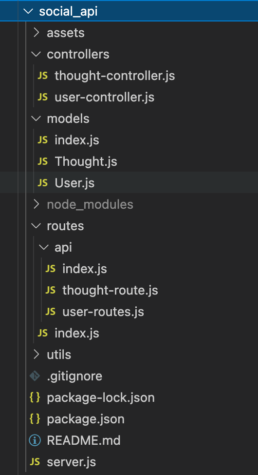
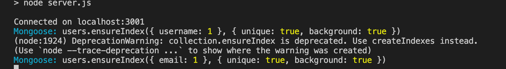

# social_api

## Description

A NoSQL database API for a social networking website, that allows for users to be created, updated and deleted. Friend lists established, thoughts by users posted, and reactions to those thoughts added by users!

## Table of Contents

- [Installation](#installation)
- [Usage](#usage)
- [Technology](#technology)
- [Questions](#questions)
- [License](#license)

## Installation

1. `Git clone` my repository

2. Your file structure should resemble the follow:

3. On the command line, in the root of the directory type `npm install`.

4. Make sure that package.json, package-lock.json and node_modules are all properly displaying

5. Run `npm test` and ensure a connection was established to your database as follow:

## Usage

Please see attached [video](https://drive.google.com/file/d/11EyhQ47omZYmpV1E1M01oW9PHqy3B8t3/view) on how to use this application!

Open Insomnia Core and test the various routes:

**USER ROUTES**

- `/api/users` retrieve all users and create a new user
- `/api/users/:id` get user by Id, update a user, or delete a user
- `/api/users/:userId/friends/:friendId` establish a friend list between users

**THOUGHT ROUTES**

- `/api/thoughts` retrieve all user thought's and add a new thought
- `/api/thoughts/:id` get thought by id, and update a thought
- `api/thoughts/:userId/:thoughtId` delete a thought
- `/api/thoughts/:thoughtId/reactions` post a reaction to a thought
- `/api/thoughts/:thoughtId/reactions/:reactionId` delete a reaction

## Technology

- MongoDB
- Express package
- Mongoose package

## Questions

Hi my name is [DiSantoz](https://github.com/DiSantoz) the developer behind the social-api !

If you have any questions about the usage of this project or any suggestions on how to better this project please feel free to contact me at:

dferreira91@outlook.com

## License

MIT License

Copyright (c) 2021 DiSantoz

Permission is hereby granted, free of charge, to any person obtaining a copy
of this software and associated documentation files (the "Software"), to deal
in the Software without restriction, including without limitation the rights
to use, copy, modify, merge, publish, distribute, sublicense, and/or sell
copies of the Software, and to permit persons to whom the Software is
furnished to do so, subject to the following conditions:

The above copyright notice and this permission notice shall be included in all
copies or substantial portions of the Software.

THE SOFTWARE IS PROVIDED "AS IS", WITHOUT WARRANTY OF ANY KIND, EXPRESS OR
IMPLIED, INCLUDING BUT NOT LIMITED TO THE WARRANTIES OF MERCHANTABILITY,
FITNESS FOR A PARTICULAR PURPOSE AND NONINFRINGEMENT. IN NO EVENT SHALL THE
AUTHORS OR COPYRIGHT HOLDERS BE LIABLE FOR ANY CLAIM, DAMAGES OR OTHER
LIABILITY, WHETHER IN AN ACTION OF CONTRACT, TORT OR OTHERWISE, ARISING FROM,
OUT OF OR IN CONNECTION WITH THE SOFTWARE OR THE USE OR OTHER DEALINGS IN THE
SOFTWARE.
